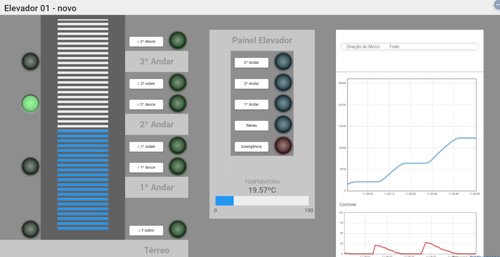
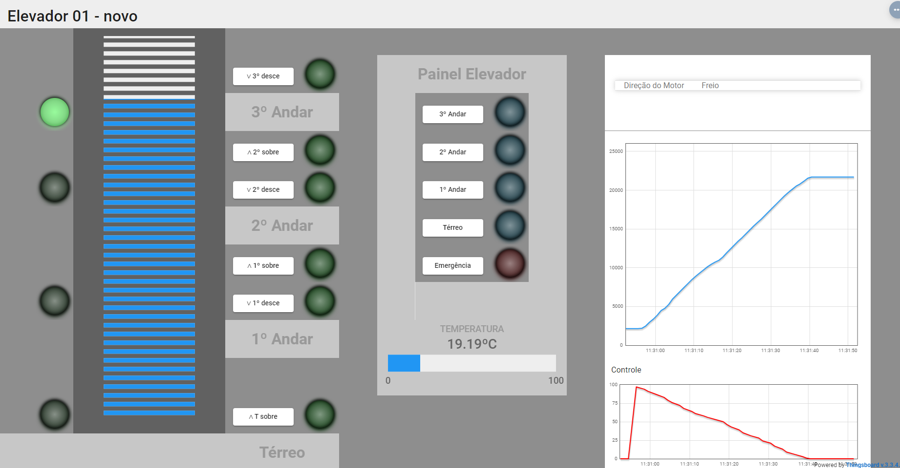
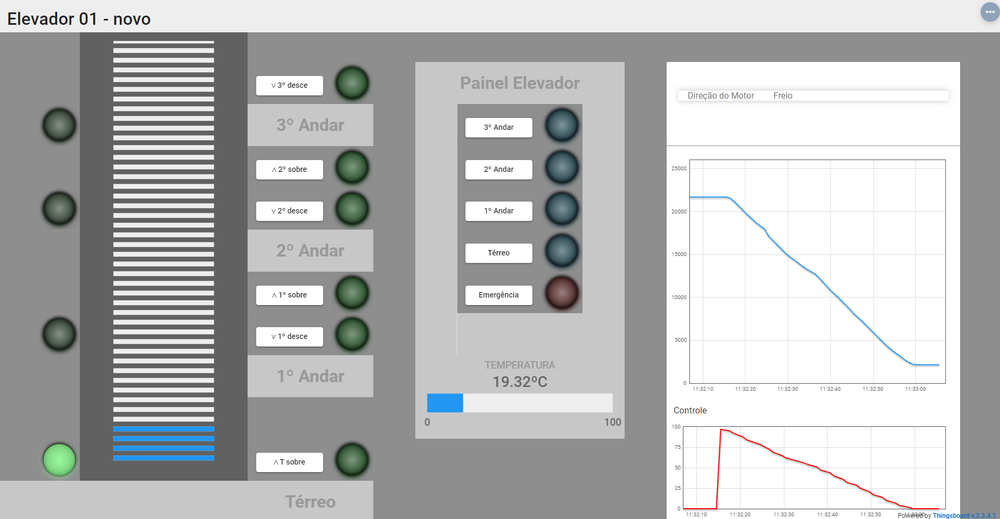
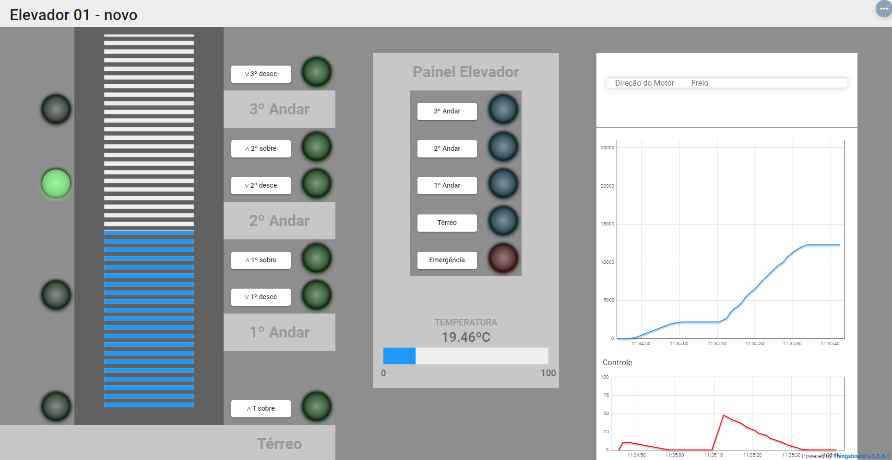
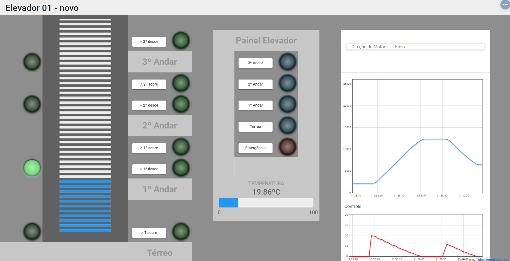

# Trabalho 2 (2023-2)

Nome: Alex Gabriel Alves Faustino  
da disciplina de Fundamentos de Sistemas Embarcados (2023/2)

## 1. Objetivos


Trilhos do Elevador | Painel de Controle  |  Elevadores
:-------------------------:|:-------------------------:|:-------------------------:
 |  | 

O trabalho envolve o desenvolvimento do software que efetua o controle completo de um elevador incluindo o controle de movimentação, acionamento dos botões internos e externos e monitoramento de temperatura. O movimento do elevador é controlado à partir de um motor elétrico e a posição é sinalizada à partir de sensores de posição e um encoder. 

O controle do elevador deve responder aos comandos dos usuários por meio de botões externos (andares) ou internos (painel de botões do elevador).

**Botões de Entrada**
- Painel Interno (Térreo, 1º Andar, 2º Andar, 3º Andar, Emergência)  
- Andares (Sobe e/ou Desce)  

## 2. Componentes do Sistema

O sistema como um todo é composto por:
1. Elevador controlado pelo motor e monitorado por sensores;
2. 04 Sensores de posição dos andares;
3. 01 Sensor BME280 / BMP280 (I2C) para a medição da temperatura interna do elevador;
4. 01 módulo Display LCD 16x2 com circuito I2C integrado (Controlador HD44780);
5. 01 Conversor lógico bidirecional (3.3V / 5V);
6. 01 Driver de potência para acionamento do motor;
7. 01 ESP32;
8. 01 Raspberry Pi 4;

## 3. Conexões entre os módulos do sistema

1. O sensor de temperatura BME280 / BMP280 está ligado ao barramento I2C e utiliza o endereço `0x76`;
2. O Encoder Digital mede a posição do motor e estará ligado à ESP32. 
3. Os sensores de posição dos andares estão ligados diretamente à portas GPIO da Raspberry Pi;
4. O motor e os pinos de direção do motor estão ambos ligados às portas GPIO e são acionados através do circuito de potência;   
    3.1. `DIR1` - Direção 1: GPIO 20 (BCM) ou Pino 38 (Board)  
    3.2. `DIR2` - Direção 2: GPIO 21 (BCM) ou Pino 40 (Board)  
    3.3. `POTM` - Potência do Motor (PWM): GPIO 12 (BCM) ou Poino 32 (Board)  
    3.4. `Sensor_Terreo` - Sensor do andar térreo: GPIO 18 (BCM) ou Pino 12 (Board)  
    3.5. `Sensor_1_andar` - Sensor do 1 andar: GPIO 23 (BCM) ou Pino 16 (Board)  
    3.6. `Sensor_2_andar` - Sensor do 2 andar: GPIO 24 (BCM) ou Pino 18 (Board)  
    3.7. `Sensor_3_andar` - Sensor do 3 andar: GPIO 25 (BCM) ou Pino 22 (Board)   
5. A ESP32 está conectada à placa Raspberry Pi via UART (Protocolo MODBUS-RTU);
6. Os botões estão ligados à GPIO da ESP32 e os comandos são transmitidos à Raspberry Pi via UART;
7. Os comandos de acionamento (alternativamente) virão do Dashboard (Thingsboard) via UART através da ESP32;

## 4. Controle PID

A abordagem de controle de posição a ser utilizada é o controle PID (Proporcional Integral Derivativo). O PID é um dos mais simples algoritmos de controle que proporciona um bom desempenho para uma grande variedade de aplicações.

O conceito fundamental desse tipo de controlador se baseia em monitorar uma variável de um processo (neste caso a posição do elevador medida pelo encoder) e medir a diferença entre seu valor atual (PAt - Posição Atual) a uma valor de referência (PRef - Posição de Referência) desejado. A partir dessa medida de **Erro = PRef - TAt**, toma-se uma ação de correção para que o sistema alcançe o valor desejado. A figura abaixo demonstra uma visão geral da estratégia de controle.


O controle PID une três tipos de ações sobre a variável de controle para minimizar o erro do sistema até que o mesmo alcançe a referência desejada. No caso deste sistema, nossa variável monitorada é a PAt - Posição Atual do elevador e o seu controle é efetuado através do acionamento do **Motor (M)**, em ambas as direções, e nosso **Erro** é a diferença entre a Posição de Referência e a Posição Atual do elevador (Erro = PRef - PAt).

Detalhando as 3 ações do PID temos:
- **Controle Proporcional (P)**: ajusta a variável de controle de forma proporcional ao erro, ou seja, quanto maior o erro, maior a intensidade de acionamento do motor (0 a 100%). Esse ajuste é feito pela variável ***Kp***.
- **Controle Integral (PI)**: ajusta a variável de controle baseando-se no tempo em que o erro acontece, acumulando este erro (integral). Esse ajuste é feito pela variável ***Ki***.
- **Controle Derivativo (PD)**: ajusta a variável de controle tendo como base a taxa de variação do erro ou a velocidade com a qual o sistema está variando o erro. Esse ajuste é feito pela variável ***Kd***.

A figura abaixo mostra as equações envolvidas no cálculo do PID.


O ajustes de cada constante do PID (Kp, Ki e Kd) tem efeitos distintos no controle do sistema conforme pode ser visto na figura  abaixo.


## 5. Requisitos

Os sistema de controle possui os seguintes requisitos:
1. O código deve ser desenvolvido em C/C++, Python ou Rust;
2. Na implementação do software, não podem haver loops infinitos que ocupem 100% da CPU;
3. O sistema deve implementar o controle de posição do elevador utilizando o controle PID atuando sobre o Motor;
4. Ao ser acionado, a potência do motor deve ser acionada sempre com uma rampa de subida até atingir a velocidade desejada (Saída do algoritmo PID);
5. O movimento do elevador deve responder aos comandos dos botões de acionamento (Dos andares ou internos do elevador);
6. O programa de controle deve consultar o valor de posição (encoder) através da comunicação UART com a ESP32 a cada 200 ms para efetuar o loop de controle de posição do elevador;
7.  **Display LCD (16x2)**: O sistema deve apresentar na tela LCD o estado do elevador e o andar atual. Os estados são:
   1. **Subindo**: Subindo entre andares;
   2. **Descendo**: Descendo entre andares;  
   3. **Parado**: Para do em um andar;
   4. **Temperatura**: temepratura medida pelo sensor dentro do elevador;
   5. O display deve ser atualizado a cada 1 segundo.  
8.  O programa deve tratar a interrupção do teclado (Ctrl + C = sinal **SIGINT**) encerrando todas as comunicações com periféricos (UART / I2C / GPIO) e desligar os atuadores (PWM do Motor);
9. O código em C/C++ deve possuir Makefile para compilação. Em Python e Rust deverão haver instruções de como executar;
10. O sistema deve conter em seu README as instruções de compilação/execução e uso, bem como gráficos* com o resultado de pelo menos 3 testes realizados no equipamento.

## 6. Comunicação UART com a ESP32
 
A ESP32 será responsável por:
1. Efetuar a medição do encoder do motor;
2. Realizar a leitura dos botões de acionamento interno do elevador;
3. Realizar a leitura dos botões dos andares;
4. Atualizar informações sobre a posição dos motores;
5. Enviar o sinal de controle no dashboard (ThingsBoard).

Para acessar as informações via UART envie mensagens em formato MODBUS com o seguinte conteúdo:

1. Código do Dispositivo no barramento: 0x01 (Endereço da ESP32);  
2. Leitura do Encoder: Código 0x23, Sub-código: 0xC1 + 4 últimos dígitos da matrícula. O retorno será o valor em Int (4 bytes) da posição do elevador com o pacote no formato MODBUS;
3. Envio do sinal de controle (Motor PWM): Código 0x16,  Sub-código: 0xC2 + 4 últimos dígitos da matrícula, Valor em Int (4 bytes);  
4. Envio da temperatura ambiente: Código 0x16,  Sub-código: 0xD1 + 4 últimos dígitos da matrícula, Valor em Float (4 bytes);  
5. Leitura dos Registradores dos Botões: Código 0x03, Sub-código: <endereço inicial> + quantidade de bytes a serem **lidos** + 4 últimos dígitos da matrícula;  
6. Escrita nos Registradores dos Botões: Código 0x06 , Sub-código: <endereço inicial> + quantidade de bytes a serem **escritos** + <bytes do estado dos botões> + 4 últimos dígitos da matrícula;  

<p style="text-align: center;">Tabela 1 - Códigos do Protocolo de Comunicação</p>

| Endereço da ESP32 | Código |	Sub-código + Matricula | Comando de Solicitação de Dados |	Mensagem de Retorno |
|:-:|:-:|:-:|:--|:--|
| **0x01** | **0x23** | **0xC1** + N N N N |	Solicita o valor do Encoder  | 0x00 0x23 0xC1 + int (4 bytes) |
| **0x01** | **0x16** | **0xC2** + (int 4 bytes) + N N N N |	Envia sinal de controle PWM (int 4 bytes) | 0x00 0x16 0xC2 |
| **0x01** | **0x16** | **0xD1** + (float 4 bytes) + N N N N |	Envia Temperatura Ambiente (Float 4 bytes) | 0x00 0x16 0xD1 |  
| **0x01** | **0x03** | **Endereço (Tab. 2)** + **Qtd** + N N N N |	Lê Registradores (Endereço inicial + Quantidade)  | 0x00 0x03 **qtd x bytes** | 
| **0x01** | **0x06** | **Endereço (Tab. 2)** + **Qtd** + **Dados** + N N N N |	Escrever nos Registradores (Endereço inicial + Quantidade + Dados)  | 0x00 0x03 **qtd x bytes** |  

**Obs.**: todas as mensagens devem ser enviadas com o CRC e também recebidas verificando o CRC. Caso esta verificação não seja válida, a mensagem deverá ser descartada e uma nova solicitação deverá ser realizada.

<p style="text-align: left;">Tabela 2 - Comandos de Usuário via UART</p>

| Sensor | Endereço |
|:--|:-:|
| **Botão Terreo Sobe**  | 0x00 |
| **Botão 1 And. Desce** | 0x01 |
| **Botão 1 And. Sobe**  | 0x02 |
| **Botão 2 And. Desce** | 0x03 |
| **Botão 2 And. Sobe**  | 0x04 |
| **Botão 3 And. Desce** | 0x05 |
| **Botão Elevador Emergência** | 0x06 |
| **Botão Elevador T** | 0x07 |
| **Botão Elevador 1** | 0x08 |
| **Botão Elevador 2** | 0x09 |
| **Botão Elevador 3** | 0x0A |

A leitura dos comandos via UART deve ser realizada a cada **50 ms**.

# como rodar

entre na pasta <./sistema-controle-elevador> e execute o seguinte comando

```console
make all  
```
apos compilar execute  

```
make run 
```

A partir daqui, o elevador subirá até o térreo e, após isso, atenderá as requisições dos usuários.

# Experimentos






